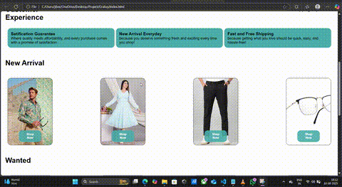

# 🛍️ E-Shop - Grabzy

A modern e-commerce front-end built with **HTML**, **CSS**, and **JavaScript**.  
This project showcases a responsive online store interface with product listings, category filtering, and a clean UI design.

## 🚀 Features
- 🖼️ Stylish product cards
- 📱 Responsive design for mobile & desktop
- 🎯 Easy navigation
- 💡 Hover effects for better UX

## 🎥 Demo


## 🛠️ Technologies Used
- HTML5
- CSS3 (Flexbox & Grid)
- JavaScript (Vanilla)

## 📂 Project Structure

├── index.html
├── style.css
├── script.js
├── assets/
│ ├── images/
│ └── icons/


## 💻 How to Run
1. Clone the repository:
   ```bash
   git clone https://github.com/muhammathjibreel25/E-Shop--Grabzy-.git
2. Open index.html in your browser.
